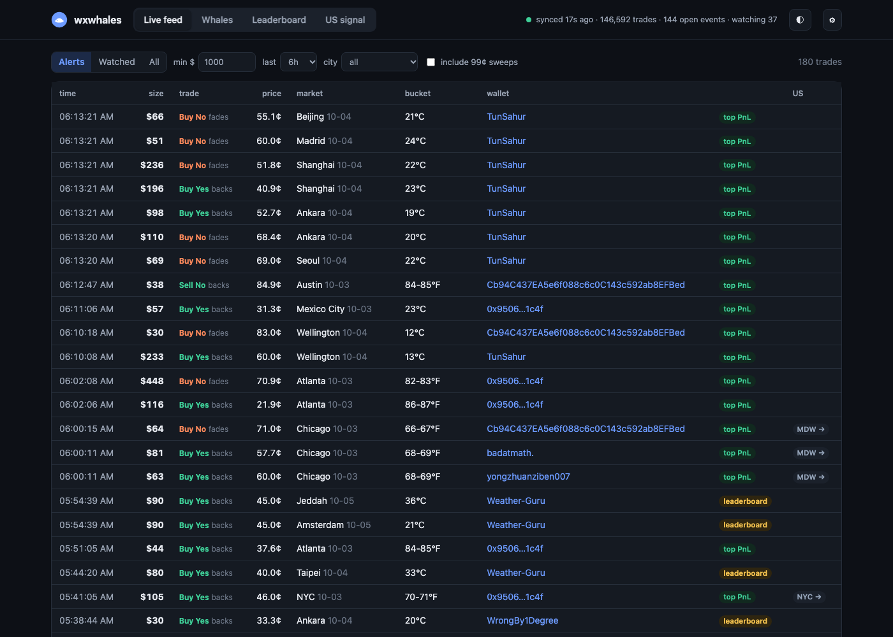
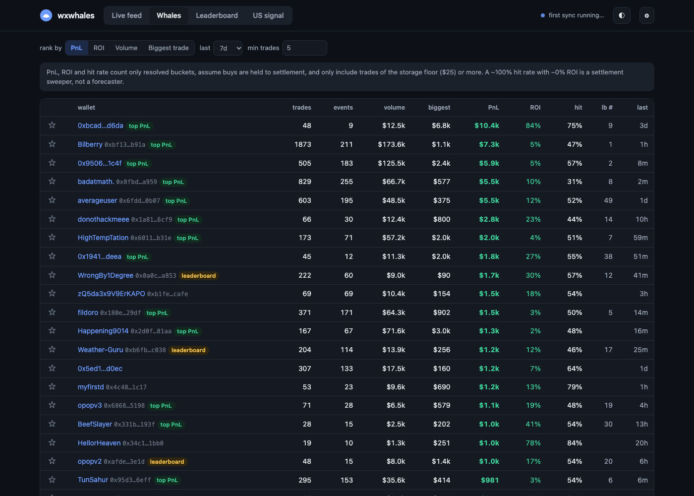
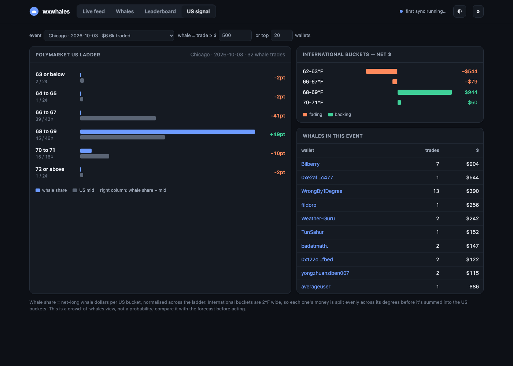

# wxwhales

Follows the biggest wallets in Polymarket temperature markets. It only watches and never places orders.

**Why international Polymarket:** Polymarket US is a KYC'd exchange, and its public API shows no trader identities. International Polymarket runs on Polygon, and its Data API tags every trade with a proxy wallet. It lists the same cities and dates, so for NYC, Miami, Chicago, LA and SF the tool maps whale positioning onto the US bucket ladder.

Uses only the Python standard library. Data lives in `data/wxwhales.sqlite`.

## The app



| Whales | US signal |
|---|---|
|  |  |


```bash
./make_app.sh        # once: builds ~/Applications/wxwhales.app (uses your current python3)
```

Double-click **wxwhales** in Applications (or Spotlight). It starts a local server on `127.0.0.1:8765` in the background and opens the dashboard in your browser. If it's already running, launching it again just reopens the page. To stop it, go to ⚙︎ Settings → **Quit wxwhales**.

- **Live feed:** big trades plus anything a watched wallet does, refreshed every 15 s. Filter by size, window or city (or "US cities only"). The **NYC/MIA/MDW/LAX/SFO →** chip jumps straight to that event's US signal.
- **Whales:** wallets ranked by PnL, ROI, volume or biggest trade. ☆ stars a wallet into `watchlist.txt`.
- **Leaderboard:** Polymarket's official WEATHER leaderboard for the day, week, month or all time.
- **US signal:** the Polymarket US ladder with whale share against US mid for each bucket, plus the net $ per international bucket and the whales in that event.
- **Wallet drawer:** click any wallet for its stats, per-city PnL, trade history with results, and a link to its Polymarket profile.
- **Settings:** sync interval, alert thresholds, auto-watch top-N, 99¢ sweeps, and macOS notifications.

A background thread syncs every 30 s, rediscovers events every 10 min, and refreshes the leaderboard hourly. The first launch after the app has been off catches up the last week, which can take a few minutes. Logs go to `data/server.log`. Without the .app, `python3 server.py` does the same thing in a terminal.

## CLI

```bash
python3 wxwhales.py sync --days 7          # first run: backfills open + last 7d of closed events (~3 min)
python3 wxwhales.py sync                   # after that: incremental, seconds
python3 wxwhales.py whales                 # rank by biggest single trade (default)
python3 wxwhales.py whales --by pnl --min-trades 10
python3 wxwhales.py leaderboard --period MONTH   # Polymarket's own WEATHER leaderboard
python3 wxwhales.py wallet 0x8afa03dd... --live  # one wallet's temperature trades
python3 wxwhales.py signal nyc 2026-09-25        # whale $ → US ladder vs US bid/ask
python3 wxwhales.py follow --notify              # live loop, macOS notifications
python3 wxwhales.py selftest                     # offline
```

`follow` skips fills at ≥0.98 or ≤0.02 (settlement sweeps) unless you pass `--include-sweeps`. It alerts on any trade of `--min-trade` ($1,000) or more. It also alerts on any trade of `--min-usd` ($25) or more by a watched wallet. Watched wallets come from three places: `watchlist.txt`, the top-N by resolved PnL in the DB, and the top-N on the official monthly WEATHER leaderboard. The watch list refreshes hourly.

## Caveats

- **The stations differ.** Intl NYC settles on LaGuardia (hourly obs max) and US NYC settles on Central Park (CLI). Intl Chicago settles on O'Hare and US Chicago on Midway. `signal` prints both stations and warns when they differ. Treat the whale view as a prior, not a price.
- **Big isn't the same as good.** The largest trades are often settlement sweepers buying at 0.99, which shows up as a ~100% hit rate with ~0% ROI. Rank by `pnl` or `roi` with `--min-trades` to find skill.
- **PnL is approximate.** It only counts trades of `--min-usd` or more in the DB window. It assumes buys are held to settlement and treats a sell as a short against settlement. For a wallet's full picture, use the official leaderboard.
- **Taker-only by default.** Pass `--all-sides` to include maker fills.
